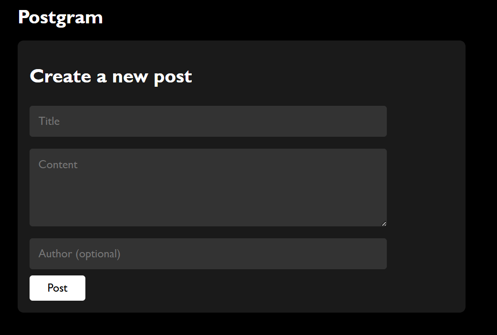

# Postgram - A Post and Comment App

## Overview
**Postgram** is an application that allows users to view posts and add comments to them. Built with **React** on the frontend and **Flask** for the backend API, this project demonstrates basic CRUD operations and styling with custom CSS.

## Features
- **View Posts**: Displays a list of posts with the title, content, author, and timestamp.
- **Add Comments**: Users can add comments to posts and choose text formatting (bold, italic, link).


## Architecture
This project follows a simple architecture:
- **Frontend**: Built with React.
- **Backend**: Flask is used for handling CRUD operations for posts and comments, with **SQLite** for storage.


## How to Set Up and Run the Application

### Prerequisites:
Ensure you have the following installed:

- Node.js 
- Python
- Flask and SQLite for the backend:

```bash
pip install flask sqlite3
```

### Steps to Set Up:
1. **Clone the repository**:

```bash
git clone https://github.com/ROHITH-M10/Posts-Comments.git
cd Posts-Comments
```

2. **Backend Setup**:  
   Navigate to the backend folder and run the Flask API server:

```bash
cd backend
python app.py
```

This will start the backend server at `http://localhost:5000`.

3. **Frontend Setup**:  
   Navigate to the frontend folder and install the necessary dependencies:

```bash
cd frontend
npm install
```

Run the frontend development server:

```bash
npm start
```

The app will be available in your browser at `http://localhost:3000`.

## Special Instructions

### Dependencies:

**Frontend**:
- `react`: The core React library for building the UI.
- `axios`: For making HTTP requests to the Flask API.

**Backend**:
- `flask`: Python micro-framework for creating the API.
- `sqlite3`: Database module for handling SQLite operations.

### Styling:
The app uses custom CSS, and the styles are defined in the `style.css` file. The app has a dark theme with easy-to-read typography and layout.

## Screenshots



